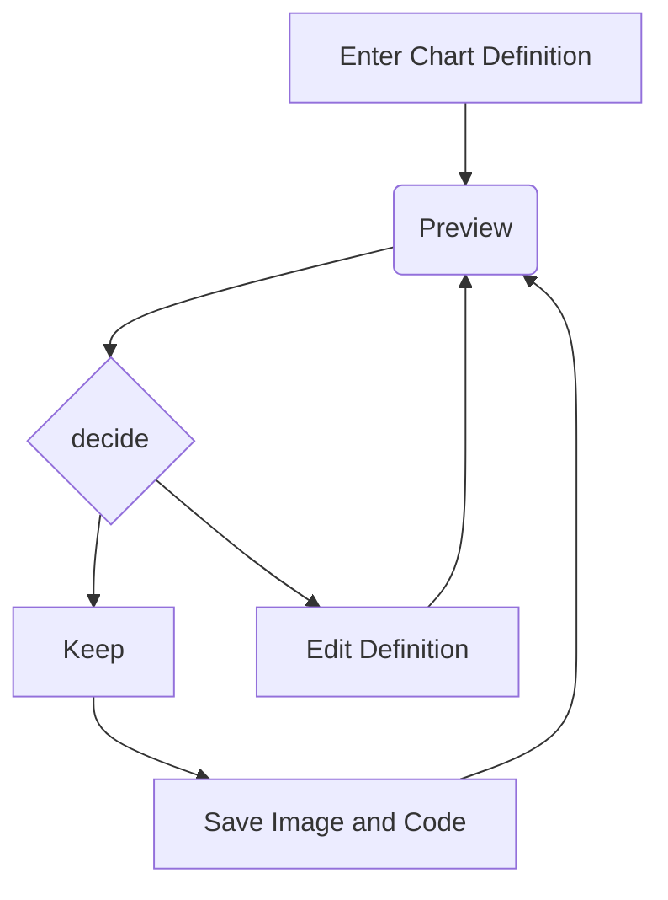

### Hi there 👋

Not the most efficient but is elegant 😎
```clj
(defn sieve [n]
  (loop [s (range 2 n)
         primes []]
    (if-let [c (first s)]
      (recur (remove #(zero? (mod % c)) s) (conj primes c))
      primes)))
```


